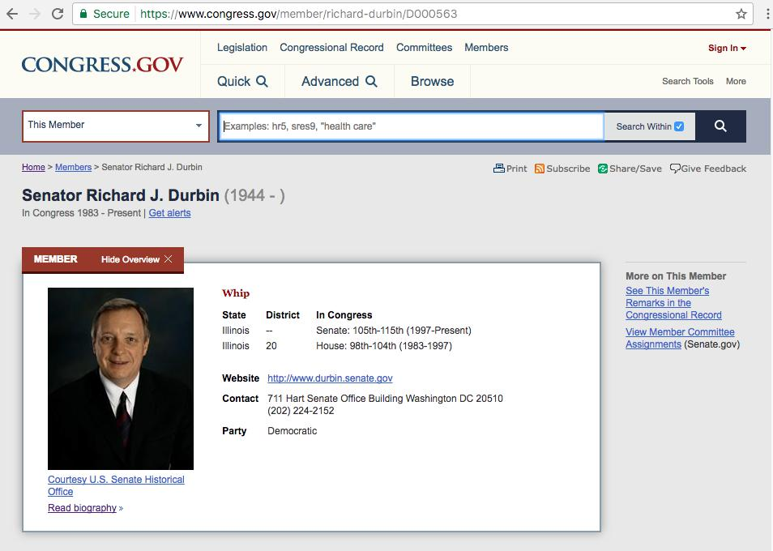
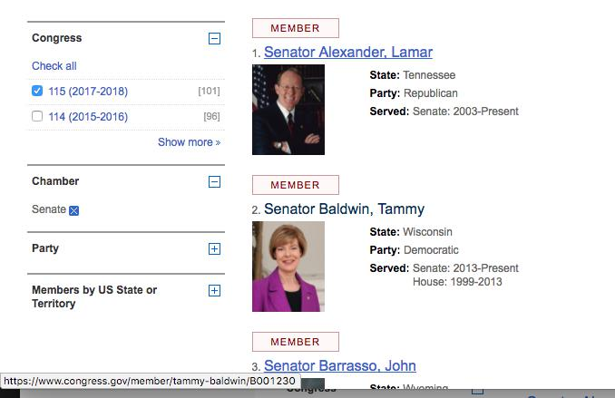
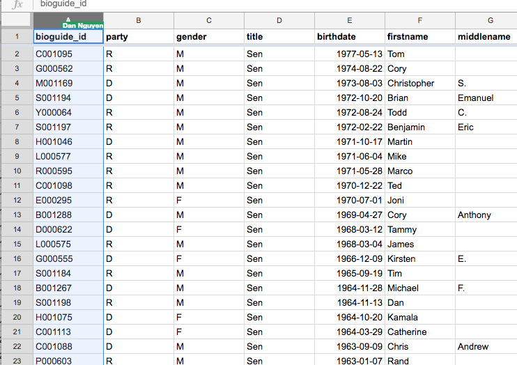
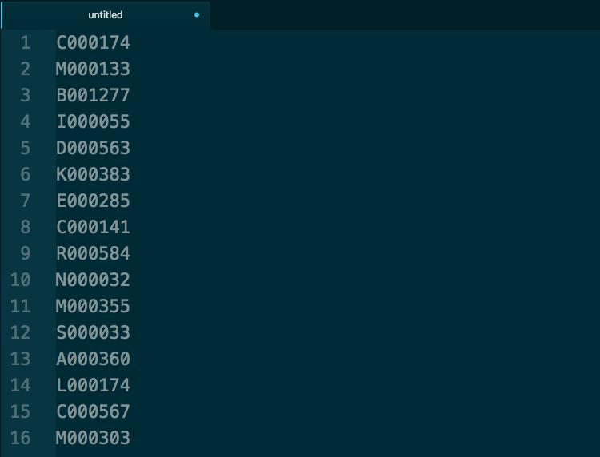
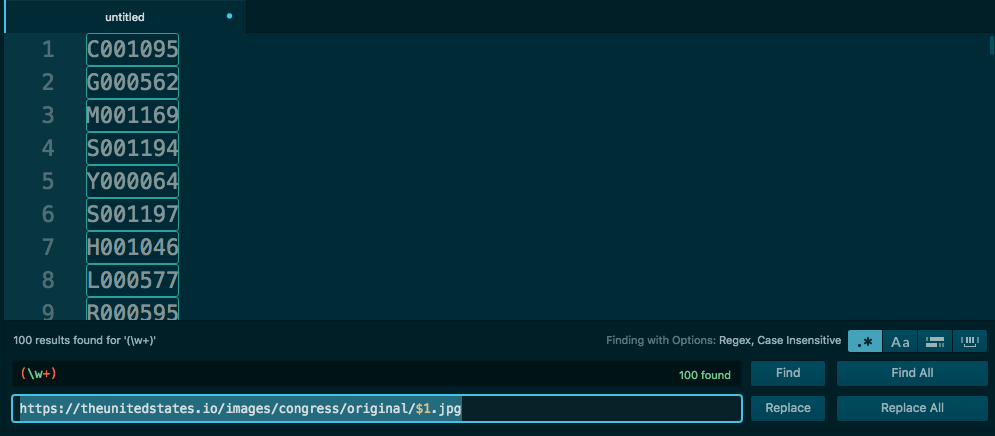
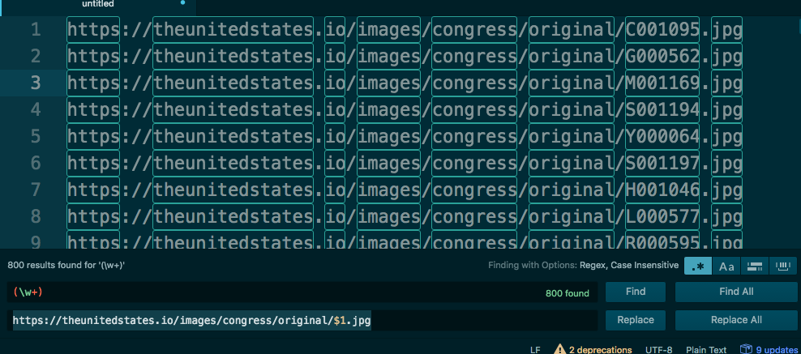
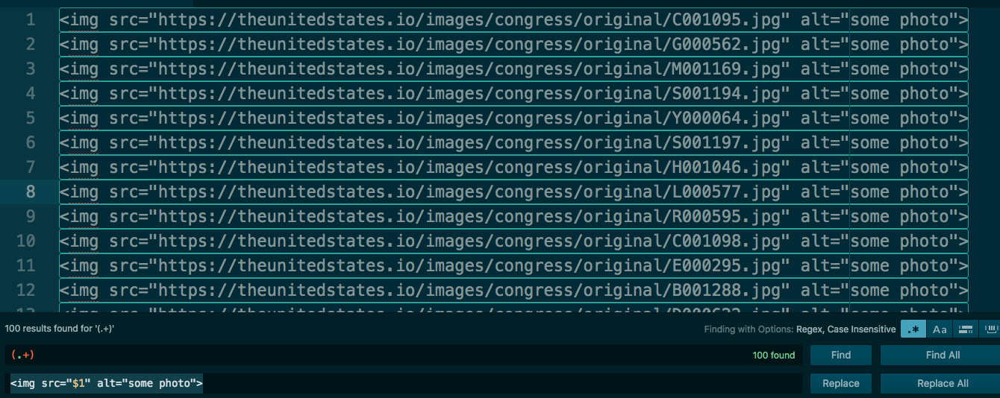

# Handmade HTML


## 01 - Make HTML from a column of spreadsheet data

In this step, we turn a simple column of text values into a webpage of smiling U.S. senator mugshot photos.


### What is the bioguide ID

Members of Congress are assigned a "bioguide id", a non-human-sensical value that is inextricably tied to to the legislator's identity -- much like a Social Security Number acts as an ID value for every American citizen -- no matter how the legislator might change their human-readable name.


For example, the senior senator from Illinois is popularly referred to as "Richard" and "Dick" Durbin, but the Congress Bioguide stores his page at this URL:

[http://bioguide.congress.gov/scripts/biodisplay.pl?index=D000563](https://projects.propublica.org/represent/members/D000563-richard-j-durbin)

And that bioguide value, `D000563`, is a *key* to other data systems, including [ProPublica's Represent](https://projects.propublica.org/represent/):

[https://projects.propublica.org/represent/members/D000563-richard-j-durbin](https://projects.propublica.org/represent/members/D000563-richard-j-durbin)


And for Congress.gov itself:

[https://www.congress.gov/member/richard-durbin/D000563](https://www.congress.gov/member/richard-durbin/D000563)



$### Using bioguide ID to refer to images

The [unitedstates Github organization](https://github.com/unitedstates/images), which is an open source collaboration of U.S. government data collection, has a unitedstates/images repo that is basically file storage for members of Congress's headshots:

[https://github.com/unitedstates/images](https://github.com/unitedstates/images)

The images can be accessed via public URL thanks to the magic of [Github Pages publishing (check out these instructions on how to setup your Github repo in the same way)](https://help.github.com/articles/configuring-a-publishing-source-for-github-pages/).

The convention is this URL pattern, with `{bioguide_id}` to be filled in:

```
https://theunitedstates.io/images/congress/original/{bioguide_id}.jpg
```

So, let's try it out with `E000295`, which is the bioguide ID for [Republican junior senator Jodi Ernst](https://www.congress.gov/member/joni-ernst/E000295):

The URLs to the images, which you can visit via browser as you would any URL:

```
https://theunitedstates.io/images/congress/original/E000295.jpg

https://theunitedstates.io/images/congress/225x275/E000295.jpg
```


### Getting bioguide id from the legislators spreadsheet

So we know 2 important things about data that we need:

1. Members of Congress can be referred to by their bioguide id
2. Easy access to their public domain headshot images only requires knowing the URL pattern (i.e. the directory of hosted imagery) and a given legislator's bioguide id.

But where do we get the bioguide ids for the 100 currently serving Senators of the 115th Congress?

If you lacked any other ideas or experience, you might remember how I pointed out the use of bioguide IDs in individual members' pages. So, it stands to reason that Congress.gov will have a list of senators, with bioguide-id-decorated URLs, and you would be right.

Here's the page for [Senators of the 115th Congress](https://www.congress.gov/members?q={%22congress%22:%22115%22,%22chamber%22:%22Senate%22})




The URL for each member contains the bioguide ID. Now you just have to click-copy-paste 100 URLs for every Senator, to get a text list that looks like this:

```
https://www.congress.gov/member/lamar-alexander/A000360
https://www.congress.gov/member/tammy-baldwin/B001230
https://www.congress.gov/member/john-barrasso/B001261
```

Just in case it's not obvious -- **do not point-and-click 100 times**...for *anything*. Such repetitive work is thankless and soul-killing, nevermind that you will likely screw up one of those 100 clicks and have to spend time backtracking.


## Congress legislators as structured data

The fact that the Congress.gov site has a predictable pattern of URLs, including how each Congressmember's page following a general pattern, this is a sign that the website, Congress.gov, is not just a bunch of webpages, but a web app, one that enumerates through a list of values to efficiently and dependably serve up webpages, i.e. webpages that correspond to a given legislator's bioguide id.

This is an automated process, which means that there is no room for a human to be pointing-and clicking *anything*. This will make more sense in the programmatic parts of this lesson. But for now, a quick backgrounder.

The Sunlight Foundation


Google spreadsheet




Paste that column of values into a spreadsheet:




### Write image URLs

The bioguide_id values are not useful in themselves. We want them to be part of a URL that points to a U.S. Senator's image:

```
https://theunitedstates.io/images/congress/original/{bioguide_id}.jpg
```

Nothing wrong with doing this the obvious, old-fashioned way: appending he first part of that URL (up to `original/`), then appending the file extension `.jpg`. Copy-paste 100 times isn't hard:


But it's definitely annoying. So let's use regular expressions to do a find-and-replace by pattern.

### Regex find-and-replace

Past references:

- [A Quick Intro to Regular Expressions](http://2017.compciv.org/guide/topics/regular-expressions/regex-early-overview.html)
- [Regex and Find-and-Replace with Atom](http://2017.compciv.org/guide/topics/end-user-software/atom/how-to-use-regex-atom.html)

Same concept as we used in the [Congress-Money-chart homework](http://2017.compjour.org/assignments/congress-money-chart.html), although a little bit simpler. We just want to turn a bioguide ID into a URL.

In Atom, pop open the Find panel with `Command-F`, enable the Regular Expression option (`Command-Option-/`). Then specify this pattern for **Find**:

      (\w+)

And this pattern for the replacement:

      https://theunitedstates.io/images/congress/original/$1.jpg





Hit the **Replace All** button:




### Write image HTML

Remember what the HTML code for embedding an image element looked like? Here's a referesher from [marksheet.io](http://marksheet.io/html-images.html)

Basic example:

```html

```

To get an array of senator headshot photos as a webpage, we need to convert our list of URLs to `` tags that refer to those URLs. This is nothing more than a text-replacement operation, whether you do it manually or with regular expression. Because in the end, HTML is all just plaintext.

See if you can figure out the find/replace regex pattern for yourself.

Find: `(.+)`

Replace: ``

And now our text file is 100 lines of HTML-formatted text:



Note: I made a typo in the screenshotted examples above. It's probably better for now to refer to the images that are `220x275`, not the `original` size. This can be fixed by doing a plain text replacement of `original` with `220x275`


## Making an HTML file

Can I repeat myself one more time? HTML is just text. Doesn't matter if you save it in a file named `something.txt` or `index.html`. So make a new file with a `.html` extension, like `01.html`, and copy-paste the 100 `` tags into it.

Throw in some other HTML elements, such as a headline at the top of the file. Save it. Then open the file by double-clicking -- hopefully your operating system will open it in your browser, to get something like this:
